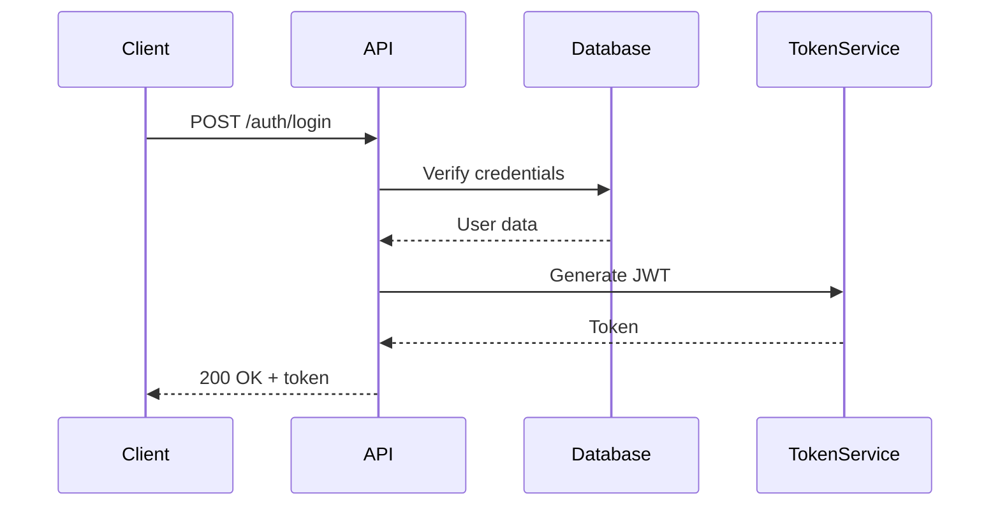

# Documentation Requirements

<!--
This file defines documentation standards for this project.
Good documentation makes code maintainable and teams productive.
-->

## Documentation Principles

### Goals
- **Clarity**: Documentation should be easy to understand
- **Currency**: Keep docs up-to-date with code changes
- **Discoverability**: Easy to find relevant information
- **Completeness**: Cover what users and developers need to know

### Target Audiences
- **End Users**: How to use the product/service
- **Developers**: How to work with the codebase
- **Contributors**: How to contribute to the project
- **Operators**: How to deploy and maintain

## Code Documentation

### Inline Comments

#### When to Comment
- **Complex Logic**: Explain non-obvious algorithms or business rules
- **Workarounds**: Document why a workaround is needed
- **TODOs**: Mark technical debt and future improvements
- **Edge Cases**: Explain handling of special cases
- **Magic Numbers**: Explain the meaning of constants

#### When NOT to Comment
- **Obvious Code**: Don't comment what the code clearly does
- **Bad Code**: Fix the code instead of explaining it
- **Redundant**: Don't repeat what function names already say

#### Comment Style
```javascript
// Good: Explains WHY
// Use exponential backoff to avoid overwhelming the API during retries
const delay = Math.pow(2, attemptNumber) * 1000;

// Bad: Explains WHAT (code is self-explanatory)
// Set delay to 2 to the power of attemptNumber times 1000
const delay = Math.pow(2, attemptNumber) * 1000;

// Good: Explains workaround
// FIXME: Temporary workaround for https://github.com/lib/issue/123
// Remove when library version > 2.5.0
const result = hackyWorkaround(data);
```

### Function/Method Documentation

#### Requirements
- **Public APIs**: Must be documented
- **Complex Functions**: Document parameters, return values, side effects
- **Library Code**: Comprehensive documentation for all exported functions

#### Documentation Format
```typescript
/**
 * Fetches user data from the API with automatic retry logic.
 *
 * @param userId - The unique identifier of the user
 * @param options - Configuration options
 * @param options.timeout - Request timeout in milliseconds (default: 5000)
 * @param options.retries - Number of retry attempts (default: 3)
 * @returns Promise resolving to user data
 * @throws {NotFoundError} When user doesn't exist
 * @throws {NetworkError} When network request fails after all retries
 *
 * @example
 * ```ts
 * const user = await fetchUser('123', { timeout: 3000, retries: 5 });
 * console.log(user.name);
 * ```
 */
async function fetchUser(
  userId: string,
  options?: { timeout?: number; retries?: number }
): Promise<User> {
  // Implementation
}
```

### Class Documentation

```typescript
/**
 * Manages user authentication and session handling.
 *
 * This class provides methods for user login, logout, and session validation.
 * It handles token refresh automatically and emits events for auth state changes.
 *
 * @example
 * ```ts
 * const auth = new AuthManager({ apiUrl: 'https://api.example.com' });
 * await auth.login('user@example.com', 'password');
 * const isValid = await auth.validateSession();
 * ```
 */
class AuthManager {
  // Implementation
}
```

### Type Documentation

```typescript
/**
 * Configuration options for the API client.
 */
interface ApiConfig {
  /** Base URL for all API requests */
  baseUrl: string;

  /** Authentication token (optional for public endpoints) */
  token?: string;

  /** Request timeout in milliseconds (default: 5000) */
  timeout?: number;

  /** Enable debug logging */
  debug?: boolean;
}
```

## Project Documentation

### README.md Structure

Required sections:
```markdown
# Project Name

Brief description of what the project does (1-2 sentences)

## Features
- Key feature 1
- Key feature 2

## Installation
# Quick start installation steps

## Quick Start
# Minimal example to get started

## Usage
# Common use cases with examples

## Configuration
# How to configure the project

## Development
# How to set up development environment
# How to run tests
# How to build

## Contributing
# Link to CONTRIBUTING.md or guidelines

## License
# License information
```

### Additional Documentation Files

#### CONTRIBUTING.md
- Code of conduct
- How to set up development environment
- How to submit issues and pull requests
- Code style and review process
- Testing requirements

#### CHANGELOG.md
- Keep a changelog following [Keep a Changelog](https://keepachangelog.com/)
- Document all notable changes
- Group by Added, Changed, Deprecated, Removed, Fixed, Security

#### API.md (for libraries/APIs)
- Complete API reference
- All public functions, classes, types
- Examples for each major feature
- Migration guides between versions

#### ARCHITECTURE.md (for complex projects)
- High-level system architecture
- Key design decisions and rationale
- Component interaction diagrams
- Data flow
- Technology choices

## API Documentation

### REST API Documentation

Use OpenAPI/Swagger specification:
```yaml
paths:
  /users/{id}:
    get:
      summary: Get user by ID
      description: Retrieves detailed information for a specific user
      parameters:
        - name: id
          in: path
          required: true
          description: User ID
          schema:
            type: string
      responses:
        '200':
          description: User found
          content:
            application/json:
              schema:
                $ref: '#/components/schemas/User'
        '404':
          description: User not found
```

### GraphQL Documentation

- Use GraphQL schema descriptions
- Document all types, fields, arguments
- Provide example queries

## Change Documentation

### Commit Messages

Format: [Conventional Commits](https://www.conventionalcommits.org/)
```
type(scope): brief description

Detailed explanation of what changed and why.
Breaking changes or important notes.

Fixes #123
```

Types: `feat`, `fix`, `docs`, `style`, `refactor`, `test`, `chore`

Examples:
```
feat(auth): add OAuth2 authentication

Implements OAuth2 login flow with Google and GitHub providers.
Tokens are stored securely in httpOnly cookies.

Closes #45

fix(api): handle null response from external service

Previously would crash when service returned null.
Now returns empty array and logs warning.

Fixes #67
```

### Pull Request Descriptions

Required sections:
```markdown
## What
Brief description of changes

## Why
Motivation and context

## How
Technical approach (if not obvious)

## Testing
How this was tested

## Screenshots (if UI changes)

## Checklist
- [ ] Tests added/updated
- [ ] Documentation updated
- [ ] No breaking changes (or documented)
```

## Diagrams and Visual Documentation

### When to Use Diagrams
- System architecture
- Data flow
- Complex algorithms
- State machines
- Deployment topology

### Tools
- **ASCII Diagrams**: For simple diagrams in code comments
- **Mermaid**: For diagrams in markdown
- **Draw.io**: For complex diagrams (export as SVG)

### Example (Mermaid)


## Documentation Maintenance

### When to Update Documentation
- **Code Changes**: Update docs in same PR as code changes
- **Bug Fixes**: Update if fix reveals doc error
- **New Features**: Document before or with feature
- **Deprecations**: Update immediately with deprecation
- **Breaking Changes**: Update with migration guide

### Documentation Review
- Docs reviewed in code review
- Periodic audit of documentation accuracy
- User feedback on documentation clarity

### Deprecation Documentation
```typescript
/**
 * Fetches user data.
 *
 * @deprecated Use fetchUserById() instead. Will be removed in v3.0.0.
 * @see fetchUserById
 */
function getUser(id: string): Promise<User> {
  console.warn('getUser() is deprecated, use fetchUserById()');
  return fetchUserById(id);
}
```

## Example Customization

```markdown
## This Project Requirements
- JSDoc comments for all exported functions and classes
- README.md must include: features, installation, quick start, API overview
- CHANGELOG.md updated with every PR that affects users
- OpenAPI spec maintained at docs/openapi.yaml
- Architecture decisions documented in docs/adr/ (Architecture Decision Records)
- Inline comments only for complex business logic or non-obvious code
- Commit messages follow Conventional Commits spec
- Pull requests require description of what, why, and how
- Mermaid diagrams for architecture and flows
- All breaking changes must include migration guide
- Documentation errors treated as bugs (must be fixed)
```

## Tips
- Write documentation as you write code
- Documentation is for humans, optimize for readability
- Examples are worth a thousand words
- Keep documentation close to code (in same repo)
- Use linters for documentation (markdownlint, etc.)
- Make documentation searchable
- Link between related documentation
- Avoid documentation that duplicates code
- Write for your audience (adjust technical level)
- Review documentation with fresh eyes or new team members
